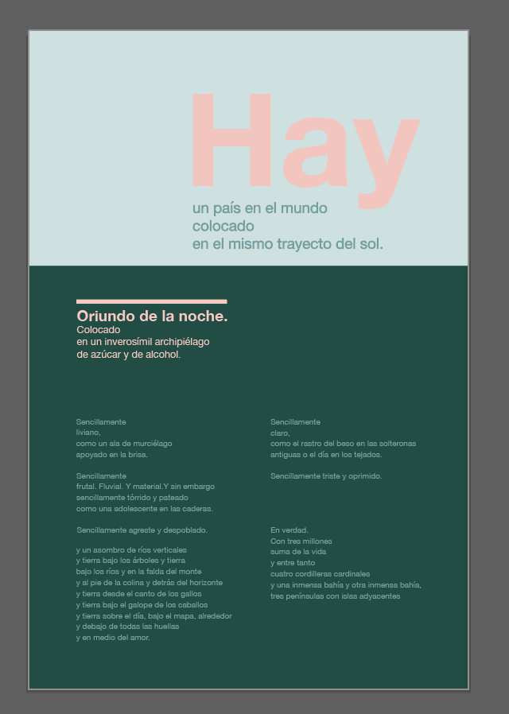

## Swiss Dominican

**Research**
Before starting the homework I already had a fairly good idea of what was needed so I started by doing some research to refresh my knowledge on Swiss design and grids. The "Web Design Process Guide" was also very helpful with the history of grids and the development information.

I found myself gravitating towards the very strict symmetrical grids. I was also feeling a little homesick this week so I decided to make the content of my poster about my home country (The Dominican Republic). I used a famous poem about the DR as my content which later on would present a new set of difficulties.

**Design**
I set out to do sketches and landed on one I thought would have good potential. I didn't want to spend too much time in the design stage because I know my challenge lies in the developing portion of the homework.

After that I jumped on my computer to start designing. I started with a grid of 6 columns:

  

But I was having problems aligning my content so I followed the advice of the guide and made it a 12 column grid and I chose Helvetica Neue as my typography because it's a classic for the style:

Once my design was aligned and finished I started applying color palettes. I ended up with two options of colors. One inspired on the greenery and the sky of the DR and another inspired on my grandma's old house. I chose the one inspired on my grandma's house with a lot of pinks and blues and all her plants.

 

I proceeded to make a quick Style Guide for my chosen option before going ahead with the development process:

 

**Development**
I considered making changes to the file we had started in class but I wanted to make sure that I understood the terminal + commands + git, etc. So I started from scratch by setting up all my files and a basic html structure.

My html had a bit of an issue in the beginning when I started adding my content because it is in a different language that requires accents in order to be written properly so I got a lot of this:

I later figured out how to add accents properly on html with "& + letter + grave/acute/tilde" I also learned how to break lines within a paragraph with " " in order to break my lines properly like the poem warrants.

I re-read the requirements for the homework and found out I had to organize my files and read my css and js files from external as opposed to what we learned in class so I did that before starting any style edits.